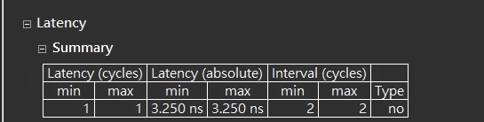
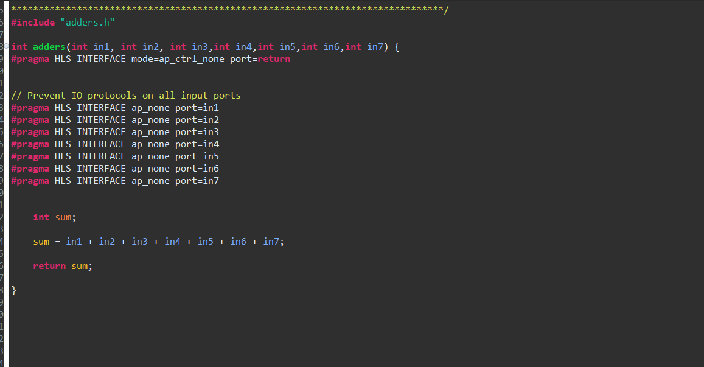
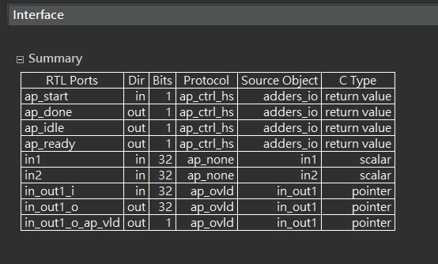
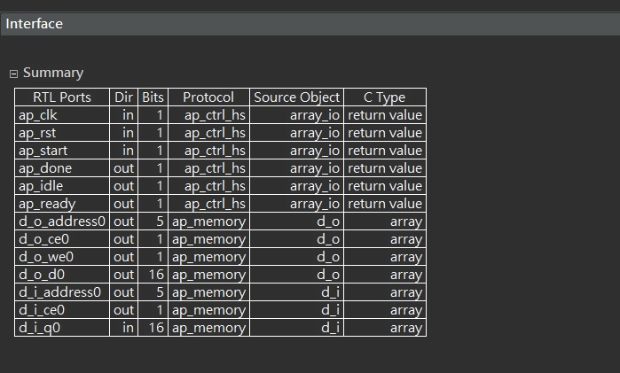

# LAB_A - Interface Synthesis
### Student ID: R11922029
### Name: 吳泓毅
### Department: NTU CSIE
### [github](https://github.com/Anderson-Wu/AAHLS_LAB_A)

## **LAB1: Review the function return and block-level protocols**


<span style="color:red">Note: If you follow the instructions in Lab1, you will get different results with the tutorial. I considered that it is caused by updating of vitis version, which makes optimization that the code become combinational logic. So I modified the code to generate the result that this Lab wanted to show</span>


### **Origin code** 


<div style="page-break-after: always;"></div> 

### **Modified code**


### **Function of code**
A simple adder

<div style="page-break-after: always;"></div> 

### **Synthesis of code**

  
Observation: 
* We can see that ap_clk and ap_rst are added, it represents that the design takes more than one clock cycle to complete.  
* Block-level I/O protocol has been added to control the RTL design: ap_start, ap_done, ap_idle, and ap_ready.  
* This design has a 32-bit output port for function return ap_return.


<div style="page-break-after: always;"></div> 

### **Waveform**
  
Observation: 
* The design does not start until ap_start is set to 1    
* The design indicates it is no longer idle by setting port ap_idle low.  
* Output signal ap_ready goes high to indicate the design is ready for new inputs on the next clock.  
* Output signal ap_done indicates when the design is finished and that the value on output port ap_return is valid.  
* Because ap_start is held high, the next transaction starts on the next clock cycle.  
* ap_done and ap_ready is set to 1 at the same time, which means it's a non-pipeline design.

<div style="page-break-after: always;"></div> 

### **Block-level protocols**
Now we create a new solution and try to add other block-level protocols. We can see that there are 4 modes for block-level protocol  
   
Explanation of each block-level protocol
* ap_ctrl_none: No block-level I/O control protocol.  
* ap_ctrl_hs: The block-level I/O control handshake protocol. This protocol is the default protocol.
* ap_ctrl_chain: The block-level I/O protocol for control chaining. This I/O protocol is primarily used for chaining pipelined blocks together. 
* s_axilite: May be applied in addition to ap_ctrl_hs or ap_ctrl_chain to implement the block-level I/O protocol as an AXI Slave Lite interface in place of separate discrete I/O ports.  

<div style="page-break-after: always;"></div> 

### **Specify block-level protocol**
using
```sh
#pragma HLS INTERFACE block-level-protocol port=return 
```

### **ap_ctrl_none**
We choose ap_ctrl_none to specifiy that we don't use any block-level protocol.  



<div style="page-break-after: always;"></div> 

#### Synthesis of code
  
Obervation:  
* in summary of the design, we can see that block-level I/O protocol(ap_start, ap_done, ap_idle, and ap_ready) aren't added to the design

#### Co-simulation with ap_ctrl_none
When do co-simulation, it will fail and show error message below. This is because RTL CoSimulation feature requires a block-level I/O protocol to sequence the test bench and RTL design for CoSimulation automatically.

<span style="color:red">ERROR: [COSIM 212-345] Cosim only supports the following 'ap_ctrl_none' designs: (1) combinational designs; (2) pipelined design with II of 1; (3) designs with array streaming or hls_stream or AXI4 stream ports.
ERROR: [COSIM 212-5] *** C/RTL co-simulation file generation failed. ***
ERROR: [COSIM 212-4] *** C/RTL co-simulation finished: FAIL ***</span>

### **Reason for modified code**
According to error message above, it shows that cosim can supports  ap_ctrl_none design with combinational designs. And the origin code can pass co-simulation with ap_ctrl_none block level protocol. So I considered the origin code is optimized to combinatonal logic in Vitis HLS 2022.1

<div style="page-break-after: always;"></div> 

## **LAB2: Understand the default I/O protocol for ports and learn how to select an I/O protocol.**

### **Origin code** 


### **Function of code**
A simple adder

### **Compare to Lab1**
We don't have function return value in Lab2, but we pass the result through function argument *in_out1.  
Because in_out exists LHS and RHS of function statements, so in_out is implemented as separate input and output ports.  

### **Port-level I/O protocol in Vitis 2022.1** 

* Port-Level I/O: No protocol   
ap_none: simplest interface type and has no other signals associated with it. Neither the input nor output data signals have associated control ports that indicate when data is read or written.

* Port-Level I/O: Wire Handshakes  
ap_vld: an valid port for input or output  
ap_ack: an acknowlegement port for input or output  
ap_hs: using both ap_vld and ap_ack, can be applied to arrays that are read or written in sequential order.  
ap_ovld: for use with in-out arguments. When the in-out is split into separate input and output ports, mode ap_none is applied to the input port and ap_vld applied to the output port. This is the default for pointer arguments that are both read and written.  
* Port-Level I/O: Memory Interface Protocol  
ap_memory: default interface of array arguments, interface appears as discrete ports.  
bram: Almost identical to ap_memory, the only difference is the way Vivado IP integrator shows the blocks.  
ap_fifo: When the design requires access to a memory element and the access is always performed in a sequential manner, that is, no random access is required. We use ap_fifo.  


<div style="page-break-after: always;"></div> 

### **Port-level I/O protocol in Lab2**

#### Synthesis of code without adding any directive

  
Observation:  
* We can ensure that the default port-level protocol of in1 and in2 is ap_none, and because in_out is both an input and output, so it is separated to two parts(in_out1_i and in_out1_o) and ap_ovld protocol is assigned to in_out1_i and in_out1_o

#### Waveform of code without adding any directive

Observartion:
* It can see that in_out has been separate to two signal in_out1_o and in_out1_i, and in_out1_o_ap_vld added to in_out1_o


#### Code with adding directives


<div style="page-break-after: always;"></div> 

#### Synthesis of code with adding directives
  
Observation:    
* For in1, because we set protocol as ap_vld, so the data on port in1 is only read when port in1_ap_vld is active-High  
* For in2, we set protocol as ap_ack, so in2_ap_ack will be active-High when data port in2 is read  
* For in_out1, we set protocol as ap_hs, so both ap_vld and ap_ack are added to in_out1_i and in_out1_o


#### Waveform of code with adding any directives


<div style="page-break-after: always;"></div> 

## **Lab3 Review how array ports are implemented and can be partitioned**

### **Origin code** 


<div style="page-break-after: always;"></div> 

### **Function of code**
Do accumulated adding


### **Solution 1**

#### Synthesis of code

Observation:  
* Function argument d_o has been synthesized to a RAM port(I/O protocol ap_memory), data port(d_o_d0), address port(d_o_address_0), chip enable(d_o_ce0), and write-enable port(do_we0).

* Function argument d_i has been synthesized to a similar RAM interface, but has an input data port (d_i_q0) and no write-enable port because this interface only reads data.

* The bits for d_o_address0 and d_i_address0 is 5, the reason is that we have total 32 elements(channels 8 x samples 4) in the array, so we need 5 bits to represent 32 address.

### **Solution 2**
#### Compare to Solution 1
We can see that in for loop, there is one input read and one output write. So even if multiple inputs and outputs are available, we cannot get benefit from it. 

To solve problem mentioned above, we unroll the for loop, let it be a SIMD structure, and we also let d_i be a two port RAM to let 2 inputs send to the function at the same time. Last, we set d_o interface as ap_fifo. 

<div style="page-break-after: always;"></div> 

#### Setting of directives of Solution 2


#### Synthesis of code

Observation:  
* We can see that d_i has been implemented as a dual-port RAM interface and d_o has been implemented as a FIFO interface with a port called d_o_full_n to determine whether FIFO is full or not

<div style="page-break-after: always;"></div> 

#### Report comparison
  
Observation:  
* When we compare the result with solution1, we can see that the latency of two solutions almost the same and solution2's hardware utilization is more than solution1 a lot. The reason is that we only use one output port(ap_fifo) in d_o. Even thought our input numbers and computation resources increased. Single output port is the main problem. So we need to let d_o also has multiple ports.

<div style="page-break-after: always;"></div> 


### **Solution 3**
According to solution2's problem, we need to partition d_o array to have more output ports. We partition the array to 4 blocks and also partition d_i to two blocks, each block has dual-port


#### Setting of directives of Solution 3


<div style="page-break-after: always;"></div> 

#### Synthesis of code
      
Observation:  
* We can see that d_o has been implemented as four separate FIFO interfaces. d_i has been implemented as two separate RAM interfaces, each uses a dual-port interface.


#### Report comparison
  
Observation:  
* Because we make both input and output be 4 ports, so the latency is decreased.

<div style="page-break-after: always;"></div> 

### **Solution 4**
In this solution, we partitioned input and output array completely, 


#### Setting of directives of Solution 4


#### Synthesis of code
        
Observation:  
* According to the synthesis report, we can see that d_i and d_o has been implemented to 32 separate ports. The port-level portocol of d_i is ap_none since it's scalar.


<div style="page-break-after: always;"></div> 

#### Report comparison  
  
Observation: 
* Because we can add port to each element of input and output array, so we only need one clock latency to get the outputs. 


<div style="page-break-after: always;"></div> 

# LAB4: Create an optimized implementation of the design and add AXI4 interfaces


### **Origin code** 


### **Function of code**
Do accumulated adding

<div style="page-break-after: always;"></div> 

### **Setting of directive**
  
In this Lab, we let input and output array be implemented as AXI4-Stream interfaces. We use cyclic parition with a factor of 8 to create 8 separate partitions. And we unroll the for loop with factor of 8 to let HLS generate 8 copies of code segment, and use pipeline and enable loop rewinding to let initial interval be 1.

<div style="page-break-after: always;"></div> 

### **Synthesis of Code**

Observation: 
* We can see that 16 axis channels is built, each channel has 3 ports(d_x_x_TVALID,d_x_x_TDATA,d_x_x_TREADY). 


<div style="page-break-after: always;"></div> 

### **Result compare to Lab3**
   Lab4| Lab3 
:-------------------------:|:-------------------------:
 |  

Observation:
* Compare the result with Lab3, although we have more latency than solution4, but because we do pipeline and rewind, so if there are sequential inputs, we can generate the result every cycle. The hardware utilization of Lab4 is less than solution4 because we use total 16 channels and solution4 in lab3 generate 64 channels.

<div style="page-break-after: always;"></div> 

### **Implement AXI4-LITE Interfaces**


We add interface with mode s_axilite to specify AXI4-Lite interface.


#### **Synthesis of code**

Observation:  
* We can see that block-level I/O protocol ports(ap_start,ap_done,etc.) have been replaced with AXI4LITE interface and output interrupt signal has been added to the design.

### **xaxi_interfaces_hw.h**
After Export RTL step, xaxi_interfaces_hw.h will be generated in solution2/imp1/ip/drivers/axi_interfaces_v1_0/src/ folder. This file contains the address to access and control the block-level interface signals. For example, setting control register 0x0 bit 0 to the value 1 will enable the ap_start port, or alternatively, setting bit 7 will enable the auto-restart and the design will re-start automatically at the end of each transaction.

